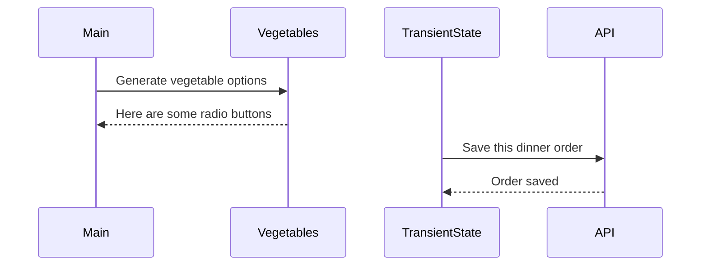

# Events and State Self-Assessment

> 🧨 Make sure you answer the vocabulary and understanding questions at the end of this document before notifying your coaches that you are done with the project

## Setup

1. Make sure you are in your `workspace` directory
1. `git clone {github repo SSH string}`
1. `cd` into the directory it creates
1. `code .` to open the project code
1. Use the `serve` command to start the web server
1. Open the URL provided in Chrome

## Requirements

### Initial Render

1. All 10 base dishes should be displayed as radio input options.
1. All 9 vegetables should be displayed as radio input options.
1. All 6 side dishes should be displayed as radio input options.
1. All previously purchases meals should be displayed below the meal options. Each purchase should display the primary key and the total cost of the purcahsed meal.

### State Management

1. When the user selects an item in any of the three columns, the choice should be stored as transient state.
1. When a user makes a choice for all three kinds of food, and then clicks the "Purchase Combo" button, a new sales object should be...
    1. Stored as permanent state in your local API.
    1. Represented as HTML below the **Monthly Sales** header in the following format **_exactly_**. Your output will not have zeroes, but the actual amount.
        ```html
        Receipt #1 = $00.00
        ```
   1. The user's choices should be cleared from transient state once the purchase is made.

## Design

Given the description and animation above...

1. Create an ERD for this application before you begin.
1. Make a list of what modules need to be created to make your application as modular as possible. Create a **Dependency Graph** for the project to be reviewed once you are complete with the assessment.
1. Create a **Sequence Diagram** that visualizes what your algorithm is for this project. We'll give you a minimal starting point.



## Vocabulary and Understanding

> 🧨 Before you click the "Assessment Complete" button on the Learning Platform, add your answers below for each question and make a commit. It is your option to request a face-to-face meeting with a coach for a vocabulary review.

1. Should transient state be represented in a database diagram? Why, or why not?
   I displayed it in my dependency diagram because at some point when the code is running, it is interacting with other modules and I wanted to show that relationship to make the code sequence more clear. Although transient state is not permanent, it does serve in this code to generate new orders based off of the users choices on the webpage (importing the setBlankChoice functions to the entree, side, and vegetable modules in order to be used in an event listener and change the selected option) before they are converted to permanent state and posted to the json server database through the use of the placeOrder function in the transient state module. 
2. In the **FoodTruck** module, you are **await**ing the invocataion of all of the component functions _(e.g. sales, veggie options, etc.)_. Why must you use the `await` keyword there? Explain what happens if you remove it.
	We are awaiting the API returning the data that we requested when we used the fetch function to receive data from the json server. The await keyword ensures that these functions wait until the previous is finished before moving on in the code so that the promises are fulfilled in the correct order. If we remove it, the promise will be unfulfilled and the data we requested will not be returned to us via the API.
3. When the user is making choices by selecting radio buttons, explain how that data is retained so that the **Purchase Combo** button works correctly.
	That data is retained firstly by using a change event listener in each module (entree, vegetable, side) so that when the radio button is selected it invokes the function that we define in the transientState module and changes the transient state of that specific category of options to the radio button that was selected. The setBlankChoice functions in the transientState module accept the parameter of the chosen object and change the matching Id within the transitive state to be that chosen object’s corresponding object key. Then I defined a function called placeOrder that is invoked when the click event of the Purchase Combo button being clicked on happens. This function is responsible for posting that changed transitive state to the json servers database and creating a new purchase that contains the users selections. 
4. You used the `map()` array method in the self assessment _(at least, you should have since it is a learning objective)_. Explain why that function is helpful as a replacement for a `for..of` loop.
It is helpful because instead of going through each object in an array and singularly performing whatever the function’s task may be, it takes the entire array and creates an entirely new array that has the changes applied to it that I outlined in the definition of whatever function we are attaching the map method to.  
